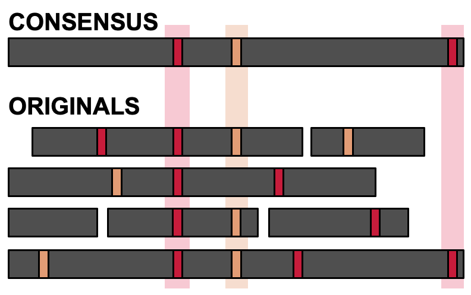

# Welcome to Nailpolish's documentation!

Nailpolish is a high-performance Rust tool designed to improve the accuracy of sequencing data by error correcting PCR duplicates.

Nailpolish identifies PCR duplicates in barcoded data (reads containing identical barcodes and UMIs, forming "duplicate groups") and applies the partial order alignment consensus algorithm to replace multiple duplicate reads with a single consensus error-corrected read. This process corrects sequencing errors which naturally occur in the reads, improving the overall quality and reliability of sequencing data.

Nailpolish operates in a reference-free manner, first identifying duplicate groups and then clustering within each duplicate group. This process ensures that only true duplicates are included in consensus calling. That is, unrelated reads that share barcodes and UMIs (due to read or demultiplexing errors) are **not** consensus called together, and are instead separated into separate clusters.

See the [Quick Start](./quickstart.md) guide to begin using Nailpolish with your data.

[^1]: For a singular .md file containing the entire documentation that you can point your LLM to, see [`llms.md`](/nailpolish/llms.md)